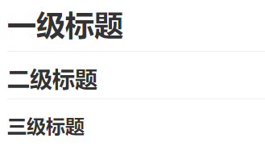
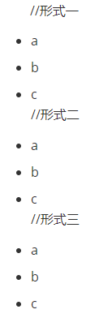
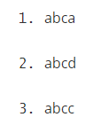
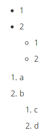

# MD语法规则  #

<p align="right"><font color=gray>作者：XiaoPb</font></p>

## 一. 标题 ##

```c
前面带#号，后面带文字，分别表示h1-h6,只到h6，而且h1下面会有一条横线
# 一级标题 #
## 二级标题 ##
### 三级标题 ###
```
<table>
	<tr>
        <td align="center"><a href="https://github.com/XiaoPb/blogs/tree/master/mdGrammarRules"><br /><sub><b>标题示例</b></sub></a>
	</tr>
</table>

## 二. 列表

### 无序列表 ###

```
//形式一
+ a
+ b
+ c
//形式二
- a
- b
- c
//形式三
* a
* b
* c
```

### 有序列表 ###

```
1. abc
2. abc
3. abc
```
<table>
	<tr>
        <td align="center"><a href="https://github.com/XiaoPb/blogs/tree/master/mdGrammarRules"><br /><sub><b>无序列表</b></sub></a>
        <td align="center"><a href="https://github.com/XiaoPb/blogs/tree/master/mdGrammarRules"><br /><sub><b>有序列表</b></sub></a>
	</tr>
</table>

### 列表嵌套 ###

```
+ 1
+ 2
  + 1
  + 2
  
1. a
2. b
  1. c
  2. d
```
<table>
	<tr>
        <td align="center"><a href="https://github.com/XiaoPb/blogs/tree/master/mdGrammarRules"><br /><sub><b>列表嵌套</b></sub></a>
	</tr>
</table>

## 三. 图片 ##

### md语法 ###

1. `  `

   例子：```  ```

<p align="left"><font color="red">结果如下：</font></p>

   

2. html方式

   ```html
   <table>
   	<tr>
          <td align="center">
          <!-- 图片居中 -->
          <a href="https://github.com/XiaoPb/blogs/tree/master/mdGrammarRules">
          <!-- 图片Git项目地址 -->
          
          <!-- 图片在项目的具体地址 -->
          <br /><sub><b>GitHub</b></sub>
          <!-- 图片标识 -->
          </a>
   	</tr>
   </table>
   ```
<p align="left"><font color="red">结果如下：</font></p>
   <table>
   	<tr>
          <td align="center">
          <a href="https://github.com/XiaoPb/blogs/tree/master/mdGrammarRules">
          
          <br /><sub><b>GitHub</b></sub>
          </a>
   	</tr>
   </table>


## 四. 列表 ##

```
|节次|星期一|星期二|星期三|星期四|星期五|星期六|星期日|
|:----:|:----:|:----:|:----:|:----:|:----:|:----:|:----:|
|第1、2节|智能仪器(1-8)|电子测量与仪器A(1-12)||电子测量与仪器A(1-12)|智能仪器(1-8)|电子工程训练2(3-5)|电子工程训练2(3-5)|
|第3、4节|||非电量检测技术(4-12)||非电量检测技术(4-11)|电子工程训练2(3-5)|电子工程训练2(3-5)|
|第5、6节|信号与系统分析B(3-16)|专业英语(测控)(1-8)|信号与系统分析B(3-16)|专业英语(测控)(1-8)|电子工程训练2(3-6)|电子工程训练2(3-5)|电子工程训练2(3-5)|
```

<p align="left"><font color="red">结果如下：</font></p>

<p align="center"><font size="72px;">2019-2020-2 课程表</font></p>

|节次|星期一|星期二|星期三|星期四|星期五|星期六|星期日|
|:----:|:----:|:----:|:----:|:----:|:----:|:----:|:----:|
|第1、2节|智能仪器(1-8)|电子测量与仪器A(1-12)||电子测量与仪器A(1-12)|智能仪器(1-8)|电子工程训练2(3-5)|电子工程训练2(3-5)|
|第3、4节|||非电量检测技术(4-12)||非电量检测技术(4-11)|电子工程训练2(3-5)|电子工程训练2(3-5)|
|第5、6节|信号与系统分析B(3-16)|专业英语(测控)(1-8)|信号与系统分析B(3-16)|专业英语(测控)(1-8)|电子工程训练2(3-6)|电子工程训练2(3-5)|电子工程训练2(3-5)|

<p align="left"><font color="red">简单示例：</font></p>

```
|Head|Head|Head|
|:-- |:--:| --:|		// 设置列居中或者右对齐或者左对齐
|Left|Center|Right|
|Left|Center|Right|
```
<p align="left"><font color="red">结果如下：</font></p>

| Head |  Head  |  Head |
| :--- | :----: | ----: |
| Left | Center | Right |
| Left | Center | Right |